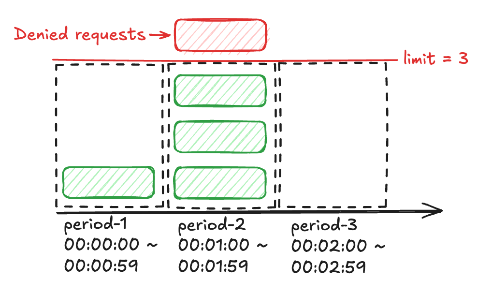
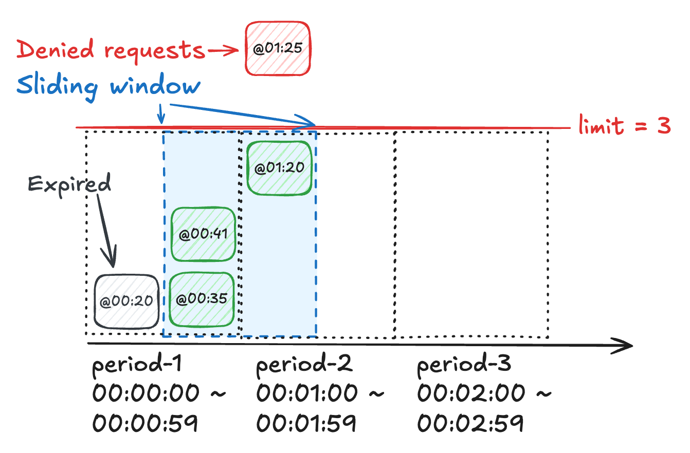

# 流量控制原理及实现

## 1. 背景

### 1.1 本质（What）

一种通过限制系统处理请求数来应对**超额流量**的保护机制。

### 1.2 场景（Why）

1）系统的 CPU、内存、网络资源有限，如果没有对请求量进行限制，在面对超额突发流量时，很有可能耗尽系统资源导致服务不可用。

2）同时可以根据业务场景，以用户、调用服务等维度设置限流策略，从而避免单个来源占据大部分系统资源，确保系统稳定性。

### 1.3 手段（How）

1）放行一部分请求，另一部分请求直接失败（429 Too Many Requests）或排队重试。

2）不同业务场景限流面向的对象不同，对于数据清洗、流媒体等 IO 密集型系统，通常针对消息的字节长度进行限流，而对于 Web 服务，更多是针对调用数限流。

## 2. 限流算法实现

### 2.1 固定窗口计数器

#### 2.1.1 工作原理

1）将时间划分为固定大小的窗口（period），设定窗口所允许通过的最大请求数（limit）。

2）每个窗口都有独立的计数器，每当有请求到达，计数器 + 1。

3）当窗口已通过请求数超过设定的最大请求数时，拒绝请求。

4）下图给出一个具体示例：

* 窗口大小为 1 min。
* 1 min 内最多允许通过 3 个请求。
* `period-2` 已接收 3 个请求，后续请求被拒绝。

#### 2.1.2 优点

1）算法简单，仅需维护当前窗口的计数器，对内存友好，处理高效。

#### 2.1.3 缺点

1）流量整形效果较差，无法平滑一个窗口内的流量，应对流量毛刺的效果一般。

2）窗口边缘的突增流量可能导致限流配额超限，如下示例：

* 每个窗口开始期间，限流配额重置。
* 在 `period-1` 后半段，通过 3 个请求，消耗完本窗口的配额。
* 在 `period-2` 前半段，通过 3 个请求，消耗完本窗口的配额。
* `period-1` 后半段 / `period-2` 前半段组成的 1 min 窗口，一共通过 6 个请求，是配额的 2 倍。

### 2.2 滑动窗口

#### 2.2.1 工作原理

1）维护一个**跟随时间移动**，大小为 period 的窗口，设定窗口所允许通过的最大请求数（limit）。

2）对加入请求及其请求时间戳进行记录，删除离开窗口的过期请求。

3）当滑动窗口记录的请求数超过设定的最大请求数时，拒绝请求。

4）下图给出一个具体示例：

* 窗口大小为 1min，窗口目前滑动到 `period-1`、`period-2` 中间。
* 滑动窗口内最多允许有 3 个请求。
* 当前时刻，滑动窗口已记录请求时间为 `00:00:34`、`00:00:41`、`00:01:20` 三个请求；`00:20` 已离开窗口，需要删除。
* `00:01:25` 进入一个请求，超过阈值，拒绝请求。

#### 2.2.2 优点

* 相比与「固定窗口计数器」，能保证在任意窗口内请求流量不会超过设定的阈值。

#### 2.2.3 缺点

* 需要记录每一个请求及其对应的时间戳，消耗大量内存。
* 存在处理窗口滑动、记录请求、删除过期请求等操作，性能比「固定窗口计数器」差。

#### 2.2.4 折衷版本

结合固定窗口，将滑动窗口划分为两部分：

* 处于当前固定窗口的部分：请求数量已知。
* 处于「上一个」固定窗口的部分：假定请求匀速到达，根据滑动窗口处于该固定窗口的比例，可推算出请求数量。

从而得到滑动窗口当前请求数（预测值）的计算公式：**当前请求数 = 上一个固定窗口请求数 x 滑动窗口占上一个固定窗口的比例  + 当前固定窗口请求数**。

下图给出一个具体示例：

* 当前请求数 = 滑动窗口占上一个固定窗口的比例（50%）x 上一个固定窗口请求数（4）+ 当前固定窗口请求数（1）= 3。
* 又来了一个请求，被拒绝。

优点：折衷版本优化了内存开销，无需保存请求时间。

缺点：当实际请求分布不均匀时，可能存在限流误判。比如上面的例子，如果上一个窗口的请求都发生在**前半部分**，即滑动窗口内实际请求数并未超限，但也触发了限流。

### 2.3 令牌桶
> 等待更新...

### 2.4 漏桶
> 等待更新...

### 2.5 GCRA
> 等待更新...

## last. Reference

* [分布式限流：基于 Redis 实现](https://pandaychen.github.io/2020/09/21/A-DISTRIBUTE-GOREDIS-RATELIMITER-ANALYSIS/)
* [凤凰架构 / 流量控制](https://icyfenix.cn/distribution/traffic-management/traffic-control.html)
* [系统设计面试：内幕指南 / 第04章：设计一个限流器](https://learning-guide.gitbook.io/system-design-interview/xi-tong-she-ji-mian-shi-nei-mu-zhi-nan-di-yi-juan/chapter-04-design-a-rate-limiter)
* [Rate Limiting, Cells, and GCRA]()
